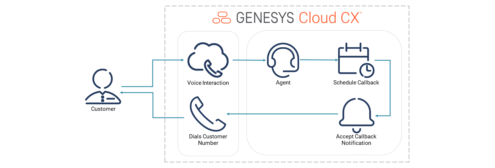
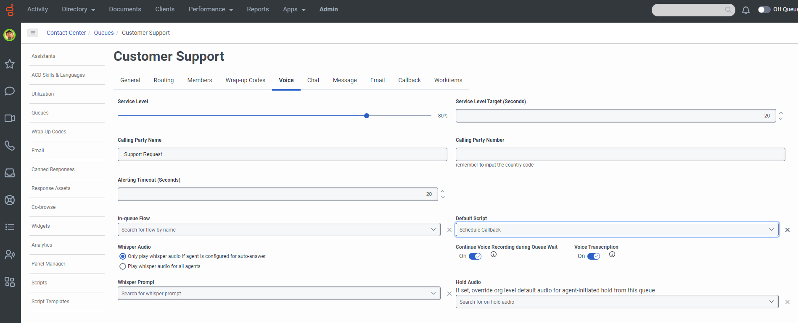
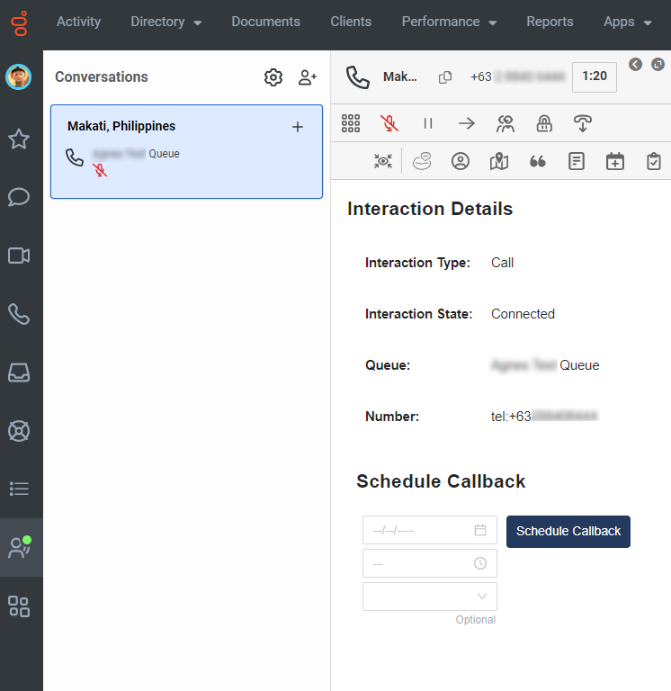
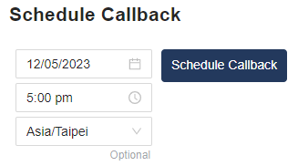
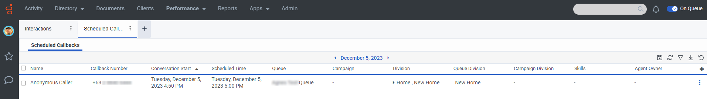
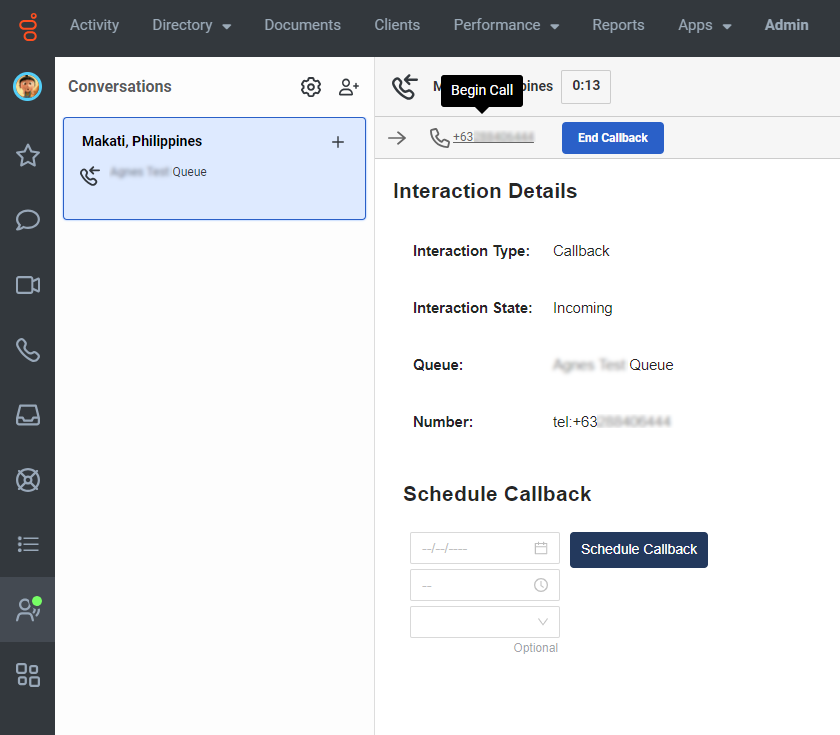

:::{"alert":"primary","title":"About Genesys Cloud Blueprints","autoCollapse":false} 
Genesys Cloud blueprints were built to help you jump-start building an application or integrating with a third-party partner. 
Blueprints are meant to outline how to build and deploy your solutions, not a production-ready turn-key solution.
 
For more details on Genesys Cloud blueprint support and practices 
please see our Genesys Cloud blueprint [FAQ](https://developer.genesys.cloud/blueprints/faq) sheet.
:::

This Genesys Cloud Developer Blueprint builds a script that allows agents to schedule a callback during a voice interaction. You deploy all the components used in this solution with the Terraform Genesys Cloud CX as Code provider.



## Scenario

An organization wants to allow an agent to schedule a callback during a voice interaction with a customer:

1. **The customer initiates a voice interaction.** The agent receives the customer's incoming interaction and answers the call.

2. **The interaction cannot be completed.** The agent cannot answer the customer’s question or needs to perform more research.

3. **The agent schedules a callback.** The agent and the customer end the interaction and wait for the callback schedule.

4. **Genesys Cloud initiates the callback.** The agent accepts the callback and Genesys Cloud dials the callback recipient.

## Solution components

* **Genesys Cloud CX** - A suite of Genesys Cloud services for enterprise-grade communications, collaboration, and contact center management. In this solution, you use an Architect inbound message flow, a Genesys Cloud integration, a Genesys Cloud queue, web messaging configuration, and web messaging deployment.
* **Genesys Cloud Callback** - A callback is a request callers can make to have their call returned when an agent is unavailable to take it right away. In contact centers, callbacks provide assistance for busy agents and provide an extra level of service to customers who encounter wait times.
* **CX as Code** - A Genesys Cloud Terraform provider that provides an interface for declaring core Genesys Cloud objects.

## Prerequisites

### Specialized knowledge

* Administrator-level knowledge of Genesys Cloud
* Experience with Terraform

### Genesys Cloud account

* A Genesys Cloud license. For more information, see [Genesys Cloud Pricing](https://www.genesys.com/pricing "Opens the Genesys Cloud pricing page") in the Genesys website.
* The Master Admin role. For more information, see [Roles and permissions overview](https://help.mypurecloud.com/?p=24360 "Opens the Roles and permissions overview article") in the Genesys Cloud Resource Center.
* CX as Code. For more information, see [CX as Code](https://developer.genesys.cloud/devapps/cx-as-code/ "Goes to the CX as Code page") in the Genesys Cloud Developer Center.

### Development tools that run in your local environment

* Terraform (the latest binary). For more information, see [Download Terraform](https://www.terraform.io/downloads.html "Goes to the Download Terraform page") on the Terraform website.

## Implementation steps

### Download the repository that contains the project files

1. Clone the [schedule-callback-via-script repository](https://github.com/GenesysCloudBlueprints/schedule-callback-via-script "Opens the schedule-callback-via-script repository in GitHub").

### Set up Genesys Cloud

1. To run this project using the Terraform provider, open a Terminal window and set the following environment variables:

 * `GENESYSCLOUD_OAUTHCLIENT_ID` - This variable is the Genesys Cloud client credential grant Id that CX as Code executes against. 
 * `GENESYSCLOUD_OAUTHCLIENT_SECRET` - This variable is the Genesys Cloud client credential secret that CX as Code executes against. 
 * `GENESYSCLOUD_REGION` - This variable is the Genesys Cloud region in your organization.

2. Run Terraform in the folder where you set the environment variables. 

### Configure your Terraform build

In the **blueprint/terraform/dev.auto.tfvars** file, set the following values, which are specific to your Genesys Cloud organization:

* `queue_name`  - The queue the agents use for the callback script
* `org_id`      - The organization ID of your Genesys Cloud instance

The following is an example of the **dev.auto.tfvars** file.

```
queue_name  = "Customer Support"
org_id      = "your-org-id"
```

### Run Terraform

You are now ready to run this blueprint solution for your organization.

1. Change to the **/terraform** folder.
2. Issue the following commands:

* `terraform init` - This command initializes a working directory that contains the Terraform configuration files.

* `terraform plan` - This command executes a trial run against your Genesys Cloud organization and shows you a list of all the Genesys Cloud resources it creates. Review this list and make sure that you are comfortable with the plan before you continue to the second step.

* `terraform apply --auto-approve` - This command creates and deploys the necessary objects in your Genesys Cloud account. The `--auto-approve` flag completes the required approval step before the command creates the objects.

After the `terraform apply --auto-approve` command successfully completes, you see the output of the entire run along with the number of objects that Terraform successfully created. Keep the following points in mind:

* This project assumes that you run this blueprint solution with a local Terraform backing state, which means that the `tfstate` files are created in the same folder where you run the project. Terraform recommends that you use local Terraform backing state files only if you run from a desktop and are comfortable with the deleted files.

* As long as you keep your local Terraform backing state projects, you can tear down this blueprint solution. To tear down the solution, change to the `docs/terraform` folder and issue the `terraform destroy --auto-approve` command. This command destroys all objects that the local Terraform backing state currently manages.

### Queue configuration

1. Navigate to **Admin > Contact Center > Queues > `queue_name`**.
2. Under the **Voice** tab, set the **Default Script** to `Schedule Callback` and click **Save**.
   

### Test the solution

1. As an agent, answer an inbound voice interaction.
   
2. Schedule a callback and end the interaction.
   
3. Add the callback in **Admin > Performance > Scheduled Callbacks**.
   
4. Answer the callback and click **Begin Call**.
   

## Additional resources

* [About scripting](https://help.mypurecloud.com/articles/about-scripting/ "Opens the About scripting page")
* [About callbacks](https://help.mypurecloud.com/articles/about-callbacks/ "Opens the About callbacks page")
* [Add a scheduled callback option to a script](https://help.mypurecloud.com/articles/add-a-schedule-callback-option-to-a-script/ "Opens the Add a scheduled callback option to a script page")
* [Github repository for the Build a script to allow agents to schedule a callback Blueprint](https://github.com/GenesysCloudBlueprints/schedule-callback-via-script/ "Opens the Github repository for the Build a script to allow agents to schedule a callback during a voice interaction Blueprint")
